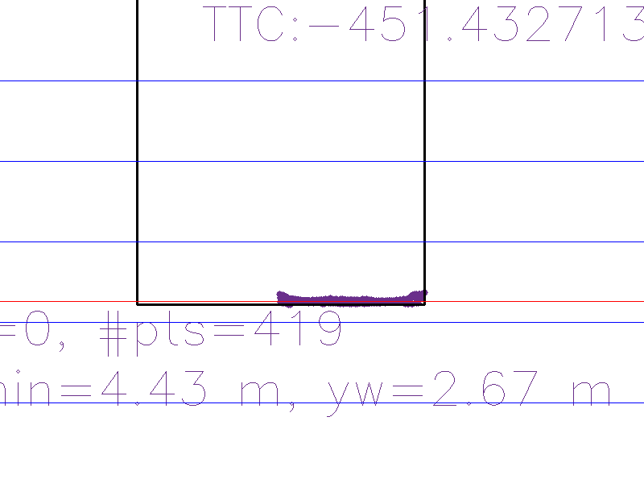

# Final Report 
## FP.1 Match 3D Objects
Implementation is done in "matchBoundingBoxes" function. In order to obtain the matching bounding boxes,
algorithm iterates over all matching keypoints, finding the containing bbox of each keypoint for both frames. Then a nested map is used to keep count of pairs of bbox matching. Finally, for each bbox is search for the bbox with the highest ocurrence (if tie, first is returned).

## FP.2 Compute Lidar-based TTC
Implementation is done in "computeTTCLidar" function. The constant velocity model is used for TTC, so the distances to the vehicle have to be computed. Distance is given by X value of keypoints. To remove outliers, only the N closest distances are averaged. Unfortunately, for the test samples we observe only the rear part of the vehicle is detected, so it seems more robust to used median of values.    

## FP.3 Associate Keypoint Correspondences with Bounding Boxes
Implementation is done in "clusterKptMatchesWithROI" function. First step is to compute average shift between matches inside de bounding box. Then in a final step, matches and keypoints are append to the collections if they meet the requirements.

## FP.4 Compute Camera-based TTC
Implementation is done in "computeTTCCamera" function. Solution is based on lab examples. The code computes the distance ratio between all combination of matched points. Then the median of the values is used as input for the TCC formula.

## FP.5 Performance Evaluation 1
Code parameters have been tunned to get good results. As explained in section FP. 2, it seems more robust using median instead of average of N closest values. In our test examples, since the car is in front of sensor, all 3D points tend to form a plane. In case the car is turning or is in other lane (the sides of the car could be detected), the median could not be stable enough and then could be better using other techniques (RANSAC, average without outliers, ...). On the other hand, in some samples the TTC computation fails. In object detection with Yolo, some objects are detected overlapping the previous and lidar points are not properly segmented:

In this case, objects different as "cars" are filtered and the problem is solved. Unfortunately this idea could not work in other situations. 

On the other hand, from analyzing the data seems that the measurements are not precise enough. As seen in next image, the TTC is wrong since the position of the car is not correctly detected:

Probably this is because of noisy data, so more robust measurement should be propose. Also the resolution of the 3D points could be improved or increase the frame rate or average measurements to get better results. 

## FP.6 Performance Evaluation 2

All detector/descriptor combinations have been executed over the 20 first images. The parameters of the algorithms are left as default values. The results can be seen in following graph:

Lidar based computation is shown for comparison, since it should be the most stable method. In general, the graph shows the results are not very stable (some outliers have been removed for clarity). For instance, HARRIS detector is very noisy, since not enough keypoints/matches are found,  which leads to errors in the calculation.

In some cases the matches are found outside de car, even though the area has been found correctly. This situation could lead to errors in the computation. In order to mitigate, object detection algorithm could be changed for a segmentation algorithm, but it should be analyzed if it is fast enough for real time. 

In general, it seems that there is not enough resolution to perform the calculation. In many cases the difference between one segment of a frame and the next varies by a few pixels. Therefore, it could be convenient to increase the frame rate to obtain more accurate measurements.

Finally, it seems SIFT/FREAK, FAST/ORB and SHI-TOMASI/ORB are the most stable methods tested. As SIFT/FREAK cmight not be suitable for real time, this method could be discarted.
   